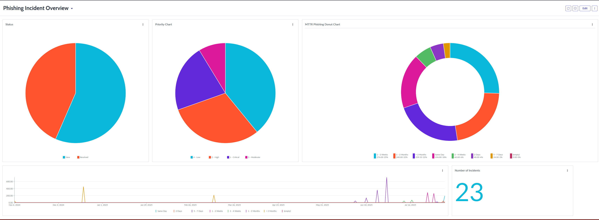
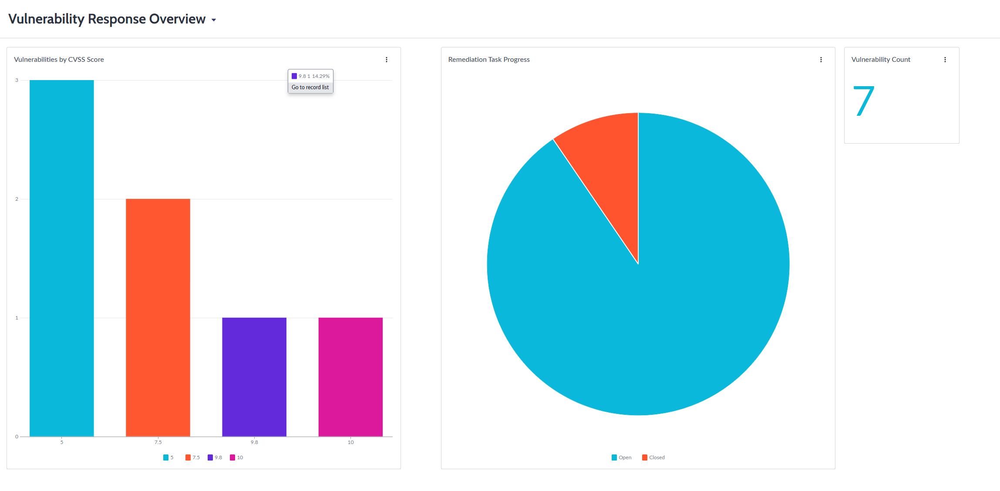

# ServiceNow SecOps Demo Project

## 📌 Overview
This project is a **ServiceNow Security Operations (SecOps) demo implementation** designed to showcase incident management, vulnerability response, and security reporting workflows.  
It simulates how a security team can use ServiceNow to automate incident handling, manage vulnerabilities, and visualize key security metrics—without requiring enterprise integrations.

---

## 🎯 Objectives
- Demonstrate **Security Incident Response (SIR)** workflows
- Simulate **Vulnerability Response (VR)** using mock data
- Create **dashboards** for incident and vulnerability metrics
- Showcase automation and best practices in a simplified environment

---

## 🛠 Tools & Technologies
| Category             | Tools/Technologies         |
|----------------------|---------------------------|
| Platform             | ServiceNow (Developer Instance) |
| Workflows            | Flow Designer, Business Rules |
| Data Import          | Import Sets (CSV)         |
| Visualization        | Performance Analytics     |
| Documentation        | Markdown |

---

## 🚀 Project Structure
```plaintext
/ServiceNow-SecOps-Demo
│
├── README.md
├── Security Incident Response/
│   ├── incident_workflow.png
│   ├── vulnerability_workflow.png
│
├── data/
│   ├── mock_vulnerabilities.csv
│
├── screenshots/
│   ├── incident_creation.png
│   ├── vulnerability_dashboard.png
│   ├── remediation_task.png
│
└── docs/
    ├── business_value.pdf
```


---

## 🔐 1. [Security Incident Response (SIR)](./Security%20Incident%20Response/README.md)
### Objective
Simulate incident ingestion and automated workflows for handling security alerts.

### Steps Implemented
1. **Mock SIEM Ingestion**
   - Created sample incidents (Phishing, Malware, Brute-force alerts).
   - Added custom fields (Alert Source, IP Address, Severity).
   
2. **Business Rules**
   - Automated assignment based on category (Phishing → Tier 1 Analyst).
   - Automated prioritization based on severity.

3. **Incident Workflow**
   - Designed a workflow in Flow Designer:
     - New → In Progress → Resolved
     - Notifications triggered at each stage.

### Deliverables
- Key Value: Automated triage reduces manual effort and accelerates response.

---

## 🛡 2. [Vulnerability Response (VR)](./Vulnerability%20Response/README.md)
### Objective
Simulate vulnerability imports and automated remediation task assignment.

### Steps Implemented
1. **Mock Vulnerability Import**
   - Imported [CSV](./Vulnerability%20Response/data/mock_vulnerabilities.csv`) with vulnerabilities (CVSS, Asset, Description).

2. **Asset Linking**
   - Created Configuration Items (CIs) in CMDB.
   - Linked vulnerabilities to assets for contextual risk analysis.

3. **Remediation Workflow**
   - Workflow auto-generates remediation tasks for High/Critical vulnerabilities.
   - Tasks assigned to IT Operations group.

### Deliverables
- Key Value: Provides clear vulnerability ownership and SLA-driven remediation.

---

## 📊 3. Dashboards & Reporting
### Objective
Visualize security data for actionable insights.

### Dashboards Created
- **Incident Dashboard**
  - Open incidents by severity
  - MTTR (Mean Time to Resolution)
  - Status breakdown (pie chart)

- **Vulnerability Dashboard**
  - Vulnerabilities by CVSS score
  - Remediation progress (open vs. closed tasks)

### Deliverables
- Key Value: Enables data-driven decision-making for security teams.
- Screenshots:



---

## 🏆 Business Value
This demo shows how organizations can:
- Automate incident triage and assignment.
- Integrate vulnerability management into security workflows.
- Use dashboards to measure security posture.
- Reduce response time and improve security visibility.

---

## 📝 Future Enhancements
- Simulate API-based SIEM integration
- Add Threat Intelligence enrichment
- Automate compliance checks with mock data

---

## 📫 Contact
**Tulsie Dukharan**  
- Email: tulsied04@gmail.com  
- LinkedIn: [linkedin.com/in/tulsie-dukharan](https://www.linkedin.com/in/tulsie-dukharan)
