# ServiceNow SecOps Demo

A simulation of **Security Incident Response (SIR)** in ServiceNow, demonstrating automated phishing incident ingestion, triage workflows, and SIEM integration for accelerated response.

---

## 📌 Project Overview
This project showcases how ServiceNow can be customized to handle security incidents efficiently, with:  
- **Custom Phishing Incident Table**  
- **Automated Assignment via Business Rules**  
- **Incident Workflow with Notifications**  
- **SIEM Integration (REST API)**  
- **IOC Tracking and Enrichment**

---

## 🛡 SIEM → ServiceNow Phishing Workflow

```mermaid
flowchart LR
    SIEM[SIEM Alert Detected] -->|Webhook/REST API| SNOW[ServiceNow: Phishing Table]
    SNOW -->|Business Rule| Assign[Auto-Assign to Phishing Response Team]
    Assign -->|Flow Designer| Workflow[Incident Workflow]
    Workflow -->|Stage 1| New[New: Incident Created]
    New --> Triage[Triage: Analyst Reviews IOCs]
    Triage --> Containment[Containment: Block Domain / Notify User]
    Containment --> Resolved[Resolved: Add Resolution Notes & Close]
    Resolved --> Report[Generate Audit Log & Notify Reporter]
```

1️⃣ Custom Phishing Incident Table
Created a dedicated u_phishing_incident table with fields:

Email Sender, Malicious URL, Subject Line

User Reported, IOCs (Journal Input), Investigation Notes

Resolution Notes, Priority, State

Assignment Group (auto-assigned), Configuration Item

🔑 Customizations

Custom numbering format (PHISH001001)

Role-based access: Only Tier 2+ analysts can view phishing incidents

IOC Journal field for investigation tracking

📷 Screenshots

2️⃣ Automated Assignment (Business Rule)
Business Rule assigns phishing incidents to the Phishing Response Team based on priority.

High-severity phishing alerts are auto-routed to Tier 2 analysts for immediate triage.

📄 Business Rule Script: scripts/auto_assignment.js

📷 Screenshot

3️⃣ Workflow Automation
Designed a custom workflow in Flow Designer for phishing incidents:

New: Incident created and assigned automatically.

Triage: Analyst reviews IOCs and validates impact.

Containment: Block malicious domains, notify users.

Resolved: Add resolution notes and close the incident.

Notifications: Triggered at each stage for visibility.

📷 Workflow Diagram

4️⃣ SIEM Integration (REST API)
Simulated ingestion from SIEM (e.g., Splunk/QRadar) into ServiceNow using REST API:

Example Payload:
{
  "short_description": "Phishing email detected for Abel Tuter",
  "u_email_sender": "checkup@s3rv1cen0w.com",
  "u_malicious_url": "hxxp://serviccenoww[.]com/checkup",
  "priority": "2",
  "u_user_reported": "Abel Tuter"
}
5️⃣ Example Case Timeline
A simulated phishing incident lifecycle with full analyst notes:
📄 View Timeline: docs/sample_phishing_incident.md

7️⃣ Key Value
✅ Automated triage reduces manual effort
✅ Seamless SIEM → ServiceNow integration
✅ Clear audit trail for investigations
✅ Realistic SOC simulation for training and demonstration
