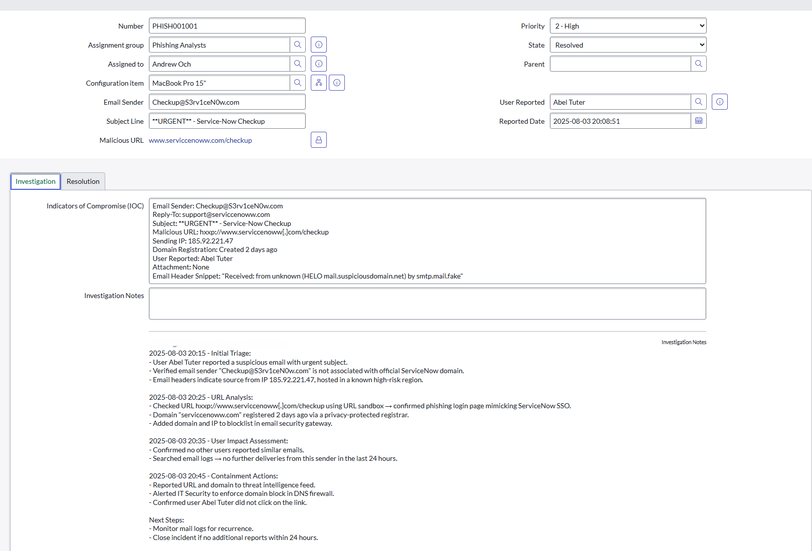
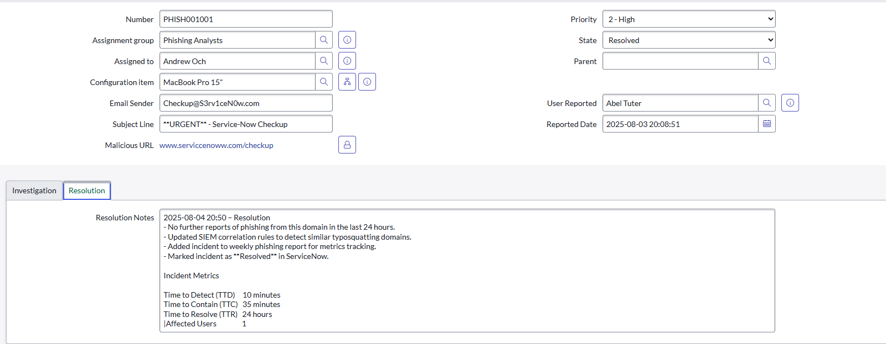

# Security Incident Response Demo

A simulation of **Security Incident Response (SIR)** in ServiceNow, demonstrating automated phishing incident ingestion, triage workflows, and SIEM integration for accelerated response.

---

## 📌 Project Overview
This project showcases how ServiceNow can be customized to handle security incidents efficiently, with:  
- **Custom Phishing Incident Table**  
- **Automated Assignment via Business Rules**  
- **Incident Workflow with Notifications**  
- **SIEM Integration (REST API)**  
- **IOC Tracking and Enrichment**

---

## 🛡 SIEM → ServiceNow Phishing Workflow


## 🎯 Phishing Incident Response (Custom Module)

### 1️⃣ Custom Phishing Incident Table
Created a dedicated `u_phishing_incident` table with fields:

- **Email Sender**
- **Malicious URL**
- **Subject Line**
- **User Reported**
- **IOCs (Journal Input)**
- **Investigation Notes**
- **Resolution Notes**
- **Priority**
- **State**
- **Assignment Group** (auto-assigned)
- **Configuration Item**

#### 🔑 Customizations
- Custom numbering format: `PHISH001001`
- Role-based access: Only **Phishing analysts** can view phishing incidents
- IOC Journal field for investigation tracking

📷 **Screenshots:** 


---

### 2️⃣ Automated Assignment (Business Rule)
- Business Rule assigns phishing incidents to the **Phishing Response Team** based on priority.
- High-severity phishing alerts are auto-routed to **Tier 2 analysts** for immediate triage.

📄 **Business Rule Script:**
`  
📷 **Screenshot:** 


---

### 3️⃣ Workflow Automation
Designed a custom workflow in Flow Designer for phishing incidents:

1. **New:** Incident created and assigned automatically.
2. **Triage:** Analyst reviews IOCs and validates impact.
3. **Containment:** Block malicious domains and notify users.
4. **Resolved:** Add resolution notes and close the incident.

- Notifications are triggered at each stage for visibility.

📷 **Workflow Diagram:** 


---

### 4️⃣ SIEM Integration (REST API)
Simulated ingestion from SIEM (e.g., Splunk/QRadar) into ServiceNow using REST API:

**Example Payload:**
```json
{
  "short_description": "Phishing email detected for Abel Tuter",
  "u_email_sender": "checkup@s3rv1cen0w.com",
  "u_malicious_url": "hxxp://serviccenoww[.]com/checkup",
  "priority": "2",
  "u_user_reported": "Abel Tuter"
}
```


### 5️⃣ Example Case Timeline  
A simulated resolved phishing incident with full analyst notes. 



---

### 7️⃣ Key Value  
✅ Automated triage reduces manual effort  
✅ Seamless SIEM → ServiceNow integration  
✅ Clear audit trail for investigations  
✅ Realistic SOC simulation for training and demonstration
