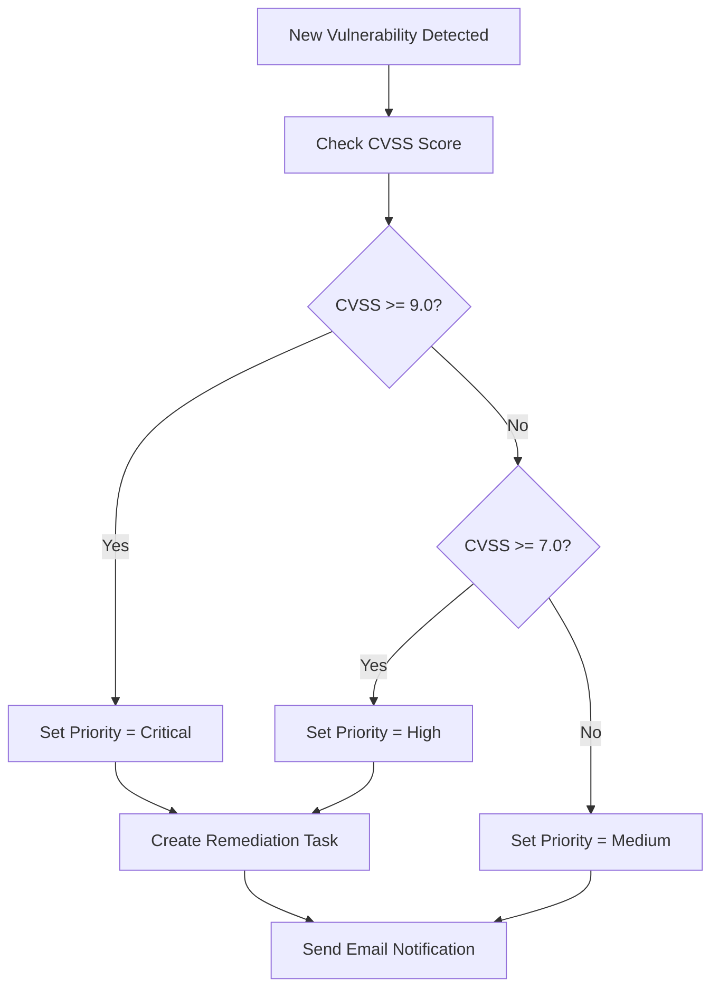

# Vulnerability Remediation Workflow

This document explains the automated workflow designed for assigning remediation tasks based on vulnerability CVSS scores.

## Overview

This ServiceNow workflow automatically:

1. Detects a new vulnerability with a CVSS score.
2. Assigns a priority based on the CVSS score.
3. Creates a remediation task.
4. Sends an email notification with relevant information.

## Priority Mapping

| CVSS Score Range | Priority  |
|------------------|-----------|
| 9.0 – 10.0       | Critical  |
| 7.0 – 8.9        | High      |
| Below 7.0        | Medium    |

## Fields Used

- **CVE**: `${u_cve}`
- **Description**: `${description}`
- **Configuration Item Asset**: `${cmdb_ci.asset}`
- **Due Date**: `${due_date}`

## Email Notification Template

```
A new vulnerability remediation task has been assigned.

CVE: ${u_cve}
Description: ${description}
Configuration item Asset: ${cmdb_ci.asset}
Due date: ${due_date}
```

## Workflow Diagram



## Included Screenshots
| Screenshot Name                                        | Description                                 |
|--------------------------------------------------------|---------------------------------------------|
| [`AutoNoTask.png`](./screenshots/AutoNoTask.png)       | Missing remediation task error              |
| [`Autotaskcriticalvuln.png`](./screenshots/Autotaskcriticalvuln.png) | Critical vulnerability task created |
| [`autovulnemail.png`](./screenshots/autovulnemail.png) | Email template for auto notification        |
| [`CIBuilder.png`](./screenshots/CIBuilder.png)         | CI Builder interface                        |
| [`CreatedCI.png`](./screenshots/CreatedCI.png)         | Confirmation of created CI                  |
| [`RemediationWorkflow.png`](./screenshots/RemediationWorkflow.png) | Visual representation of workflow |
| [`VulnResponseList.png`](./screenshots/VulnResponseList.png) | List view of vulnerabilities          |
| [`incident_creation.png`](./screenshots/incident_creation.png) | Incident creation example              |
| [`vulnerability_dashboard.png`](./screenshots/vulnerability_dashboard.png) | Dashboard view of vulnerabilities |
| [`remediation_task.png`](./screenshots/remediation_task.png) | Sample remediation task                  |
